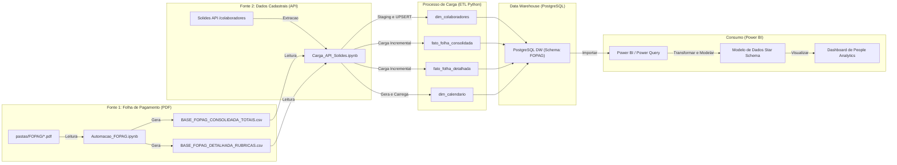
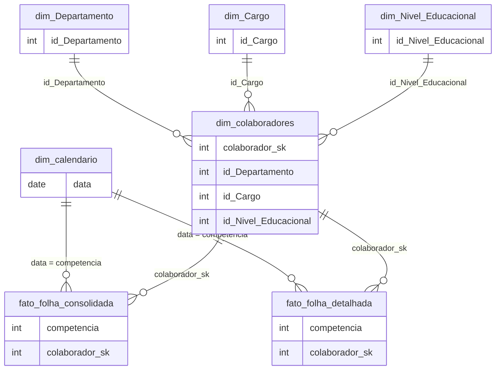

# 🧩 Projeto de ETL e Data Warehouse para People Analytics (Solides API & FOPAG PDFs)

Este projeto implementa um **pipeline de dados completo** para centralizar informações de **Recursos Humanos**, unificando dados **cadastrais (API Solides)** e **financeiros (Folha de Pagamento - PDFs)** em um **Data Warehouse dimensional (PostgreSQL)**, pronto para análise em **Power BI**.

---

## 🚀 1. Visão Geral da Arquitetura

O processo é dividido em duas etapas principais, orquestradas por **dois notebooks Python**:

- **`Automação_FOPAG.ipynb`** → Parser de PDFs da folha de pagamento.
- **`Carga_API_Solides.ipynb`** → Orquestrador ETL (API + CSV → PostgreSQL).

### 🧠 Fluxo do Processo (Mermaid)



# ⚙️ 2. Componentes do Projeto
## 🧾 Automação_FOPAG.ipynb (Parser de PDF)

Objetivo: Extrair informações de folhas de pagamento em PDF e gerar arquivos CSV estruturados.
´´´Tecnologias: pdfplumber, pandas, re´´´

## Principais Funcionalidades:

Leitura em lote: Varre o diretório FOPAG/ e processa todos os PDFs.
Extração robusta: Usa RegEx para identificar blocos de texto e extrair campos de cada colaborador.
Mapeamento de rubricas: Traduz códigos de rubricas em descrições padronizadas e classifica como Provento ou Desconto.
Compatibilidade com diferentes layouts: Detecta holerites e recibos de férias automaticamente.

Saídas:

`BASE_FOPAG_CONSOLIDADA_TOTAIS.csv`

`BASE_FOPAG_DETALHADA_RUBRICAS.csv`

## 🧠(ETL do Data Warehouse) - `Carga_API_Solides.ipynb`

### Objetivo: Centralizar e estruturar os dados no PostgreSQL.

### Tecnologias: `requests`, `pandas`, `sqlalchemy`, `python-dotenv`

### Etapas ETL:

### 🔹 Extract

API Solides: Extrai colaboradores do endpoint `/colaboradores` e detalhes de `/colaboradores/{id}.`

CSVs: Lê as bases geradas pelo parser de PDF.

### 🔹 Transform

Normalização e renomeação de colunas.

Conversão de valores monetários e tratamento de CPFs.

Geração da tabela de calendário (dim_calendario).

### 🔹 Load

`dim_colaboradores (UPSERT)`: Atualiza ou insere colaboradores.

`fato_folha_* (Incremental)`: Estratégia DELETE-then-INSERT por competência.

Criação automática de colunas: Usa ALTER TABLE ... ADD COLUMN IF NOT EXISTS para evitar erros.

# 🧱 3. Estrutura do Data Warehouse

O modelo segue o padrão Star Schema (Esquema Estrela).

### 🧩 **Dimensões**
|Tabela	|Fonte	|Descrição|
|----------|---------|--------|
|`dim_colaboradores`|	API Solides	Dados cadastrais e demográficos |(nome, cargo, departamento, salário, etc.)|
|`dim_calendario`|	SQL	Datas com atributos de tempo |(ano, mês, trimestre, etc.)|
### 📊 **Fatos**
|Tabela	Fonte |Granularidade	|Descrição|
|-----------|-------------|---------------|
`fato_folha_consolidada`|	Totais CSV	|1 linha por colaborador/mês	|Proventos, Descontos, Bases INSS/IRRF|
`fato_folha_detalhada`	|Rubricas CSV	|1 linha por rubrica/mês/colaborador|	Rubricas individuais (ex: Horas Extras, INSS)|

#⚡ 4. Como Executar o Projeto
###🔧 Pré-requisitos

- Python 3.10+
- PostgreSQL
- Token de acesso à API Solides

### 🧰 Configuração
### 1️⃣ Clonar o Repositório
`git clone <url-do-repositorio>
cd <nome-do-repositorio>`

### 2️⃣ Criar Ambiente Virtual
`python -m venv .venv
source .venv/bin/activate  # Linux/macOS
.venv\Scripts\activate      # Windows`

### 3️⃣ Instalar Dependências

```requirements.txt
pandas
pdfplumber
sqlalchemy
psycopg2-binary
requests
python-dotenv
pip install -r requirements.txt
```

### 4️⃣ Criar o arquivo .env
# Credenciais da API Solides
`SOLIDES_API_TOKEN="seu_token_aqui"`

# Banco de Dados PostgreSQL
```DB_USER="seu_usuario"
DB_PASS="sua_senha"
DB_HOST="localhost"
DB_PORT="5432"
DB_NAME="postgres"
DB_SCHEMA="FOPAG"
```
### 🚀 Execução

1-Coloque os PDFs na pasta FOPAG/

2-Execute o notebook Automação_FOPAG.ipynb

3-Execute o notebook Carga_API_Solides.ipynb

4-Conecte o Power BI ao schema FOPAG do PostgreSQL

### 🧮 5. Boas Práticas e Destaques Técnicos

✅ Segurança: Credenciais isoladas em .env

✅ Idempotência: UPSERT em dim_colaboradores

✅ Carga Incremental: DELETE-then-INSERT por competência

✅ Tolerância a mudanças no schema: ADD COLUMN IF NOT EXISTS

✅ Modelagem em Estrela: ideal para análise no Power BI

### 🔍 6. Próximos Passos (Melhorias Futuras)

- Unificar scripts: PDF → DataFrame → Postgres (sem CSV intermediário).

- Adicionar logging estruturado: usando logging para auditoria e controle.

- Substituição de chaves no ETL: inserir colaborador_sk diretamente nas Fatos no PostgreSQL.

### 📊 7. Modelagem e Transformações no Power BI

O modelo no Power BI implementa um Star Schema otimizado, com substituição de chaves e normalização.

### 🔁 Transformações no Power Query
🔸 Substituição de Chaves (Key Substitution)

Merge entre `fato_* e dim_colaboradores usando cpf_csv = cpf.`

Extração da chave `colaborador_sk para substituir cpf_csv.`

🔸 Criação de Dimensões (Snowflaking)

`dim_Cargo`, `dim_Departamento`, `dim_Nivel_Educacional criadas referenciando dim_colaboradores`.

### 🔗 Relacionamentos (Modelo Estrela)

🧠 Autor

João Pedro dos Santos Santana
📊 Analista de BI Júnior & Entusiasta de People Analytics
📧 LinkedIn
 | Notion

Projeto desenvolvido para automatizar o fluxo de dados de RH, reduzir retrabalho manual e fortalecer análises de People Analytics com dados confiáveis e estruturados.
