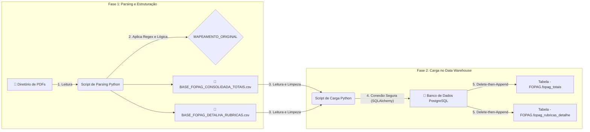

# 🚀 ETL de Folha de Pagamento (PDF para PostgreSQL)

> Um pipeline de dados em Python completo para automatizar a extração, transformação e carga (ETL) de relatórios complexos de folha de pagamento em PDF para um banco de dados PostgreSQL.

Este projeto foi desenhado para processar diretórios contendo múltiplos arquivos PDF de folha de pagamento (holerites, recibos de férias, 13º salário), extrair dados de cada funcionário e de cada rubrica, e carregar tudo de forma estruturada em um data warehouse no PostgreSQL.



## ✨ Funcionalidades Principais

* **Extração de PDF:** Utiliza o `pdfplumber` para ler e extrair texto de arquivos PDF.
* **Parsing Robusto com Regex:** Emprega expressões regulares (`re`) para lidar com layouts de PDF complexos e variáveis, identificando corretamente cada funcionário e seus dados, mesmo em documentos com múltiplos holerites.
* **Mapeamento de Rubricas:** Inclui um dicionário de mapeamento central (`MAPEAMENTO_ORIGINAL`) que traduz códigos internos de pagamento (ex: '101', '998') para descrições padronizadas (ex: 'P_Salario_Base', 'D_INSS').
* **Geração de Duas Bases:** O script de parsing gera duas saídas principais:
    1.  **Consolidada:** Uma linha por funcionário por competência, com todos os totais (Proventos, Descontos, Líquido, Bases de Cálculo).
    2.  **Detalhada:** Uma linha para cada rubrica (item) de cada funcionário, permitindo análises granulares.
* **ETL Incremental para Postgres:** O segundo script (`célula 4`) implementa um pipeline de ETL que carrega os CSVs gerados para o PostgreSQL.
* **Carga Idempotente (Delete-then-Append):** A carga no banco é segura para ser re-executada. O script deleta os dados de uma competência que já existe antes de inserir os novos, evitando duplicatas e garantindo que os dados estejam sempre atualizados.
* **Tipagem de Dados SQL:** Define explicitamente os tipos de dados no PostgreSQL (`Date`, `Numeric(10, 2)`) para garantir a integridade e precisão dos dados financeiros.

## ⚙️ Como Funciona: O Pipeline de Duas Etapas

O processo é dividido em duas grandes etapas, ambas contidas no notebook `leitor_fopag.ipynb`.

### Etapa 1: Parsing de PDF para CSV

A primeira parte do pipeline (célula principal) foca em ler os PDFs brutos e transformá-los em arquivos CSV estruturados.

1.  **Leitura:** O script varre o diretório `FOPAG/` em busca de todos os arquivos `.pdf`.
2.  **Extração:** O texto de cada PDF é extraído.
3.  **Divisão:** O texto é dividido em blocos, um para cada funcionário, usando regex para identificar os cabeçalhos.
4.  **Extração de Dados:** Para cada bloco de funcionário, o script usa regex para extrair:
    * Dados do Cabeçalho (Nome, CPF, Cargo, Admissão, Departamento).
    * Dados do Rodapé (Total Proventos, Total Descontos, Líquido, Bases de INSS, FGTS, IRRF). A lógica é robusta para encontrar esses valores tanto em holerites mensais quanto em recibos de férias.
    * Dados da Tabela de Rubricas (Código, Descrição, Valor).
5.  **Mapeamento:** As rubricas extraídas são traduzidas usando o `MAPEAMENTO_CODIGOS`.
6.  **Saída:** Os dados são salvos em dois arquivos:
    * `BASE_FOPAG_CONSOLIDADA_TOTAIS.csv`
    * `BASE_FOPAG_DETALHADA_RUBRICAS.csv`

### Etapa 2: Carga dos CSVs para o PostgreSQL

A segunda parte do pipeline (célula 4) pega os CSVs gerados e os carrega no banco de dados.

1.  **Extração (dos CSVs):** Os dois arquivos CSV são lidos com o `pandas`, forçando todos os campos como `string` para um tratamento de tipos controlado.
2.  **Transformação:** Uma função `tratar_tipos_dataframe_csv` realiza a limpeza final:
    * Converte colunas de data (ex: `01/10/2025` ou `2025-10-01`) para o formato `Date` do SQL.
    * Converte colunas monetárias (ex: `1.234,56`) para `Decimal`, garantindo precisão.
    * Limpa e padroniza campos de texto e o CPF.
3.  **Carga (Load):**
    * O script se conecta ao banco PostgreSQL usando credenciais de um arquivo `.env`.
    * Ele verifica as competências (ex: '2025-10-01') presentes nos arquivos CSV.
    * **Lógica Incremental:** Ele executa um `DELETE FROM tabela WHERE competencia IN (...)` para remover quaisquer dados dessas competências que já existam no banco.
    * **Append:** Por fim, ele usa `to_sql(if_exists='append')` para inserir os novos dados tratados nas tabelas `FOPAG.fopag_totais` e `FOPAG.fopag_rubricas_detalhe`.

## 🛠️ Tecnologias Utilizadas

* **Python 3.11+**
* **Pandas:** Para manipulação e estruturação dos dados.
* **PDFPlumber:** Para extração de texto de PDFs.
* **SQLAlchemy:** Para ORM e definição de tipos de dados na conexão com o banco.
* **Psycopg2-binary:** Driver de conexão com o PostgreSQL.
* **Python-Dotenv:** Para gerenciamento de credenciais de banco de dados.
* **PostgreSQL:** O banco de dados de destino.

## 🏁 Como Executar o Projeto

### 1. Pré-requisitos

* Python 3.11 ou superior
* Um servidor PostgreSQL acessível

### 2. Configuração do Ambiente

1.  Clone este repositório:
    ```bash
    git clone [https://github.com/seu-usuario/ETL-Folha-Pagamento-PDF.git](https://github.com/seu-usuario/ETL-Folha-Pagamento-PDF.git)
    cd ETL-Folha-Pagamento-PDF
    ```

2.  Crie e ative um ambiente virtual:
    ```bash
    python -m venv .venv
    # Windows
    .\.venv\Scripts\activate
    # macOS/Linux
    source .venv/bin/activate
    ```

3.  Crie um arquivo `requirements.txt` com o seguinte conteúdo:
    ```
    pandas
    pdfplumber
    SQLAlchemy
    psycopg2-binary
    python-dotenv
    ```

4.  Instale as dependências:
    ```bash
    pip install -r requirements.txt
    ```

5.  Crie um arquivo `.env` na raiz do projeto para suas credenciais do PostgreSQL. O script espera por estas variáveis:
    ```ini
    # .env
    DB_USER="seu_usuario_postgres"
    DB_PASS="sua_senha_segura"
    DB_HOST="localhost"
    DB_PORT="5432"
    DB_NAME="postgres"
    DB_SCHEMA="FOPAG"
    ```

### 3. Execução

1.  Crie uma pasta chamada `FOPAG` na raiz do projeto.
2.  Coloque todos os seus arquivos PDF de folha de pagamento dentro da pasta `FOPAG`.
3.  Abra o notebook `leitor_fopag.ipynb` em seu editor (VS Code, Jupyter Lab).
4.  Execute a **primeira célula de instalação** (`!pip install...`) ou pule-a, já que usamos o `requirements.txt`.
5.  Execute a **célula principal (Etapa 1)**. Isso irá processar os PDFs e criar os dois arquivos CSV. Monitore o output para ver o progresso.
6.  (Opcional) Execute a **célula de verificação (Etapa 1.5)** para checar os dados de um funcionário específico no CSV gerado.
7.  Execute a **célula de carga (Etapa 2)**. Isso irá conectar ao seu banco de dados, criar o schema `FOPAG` (se não existir) e carregar os dados nas tabelas `fopag_totais` e `fopag_rubricas_detalhe`.

Após a execução, seus dados estarão prontos para serem consultados no PostgreSQL.
